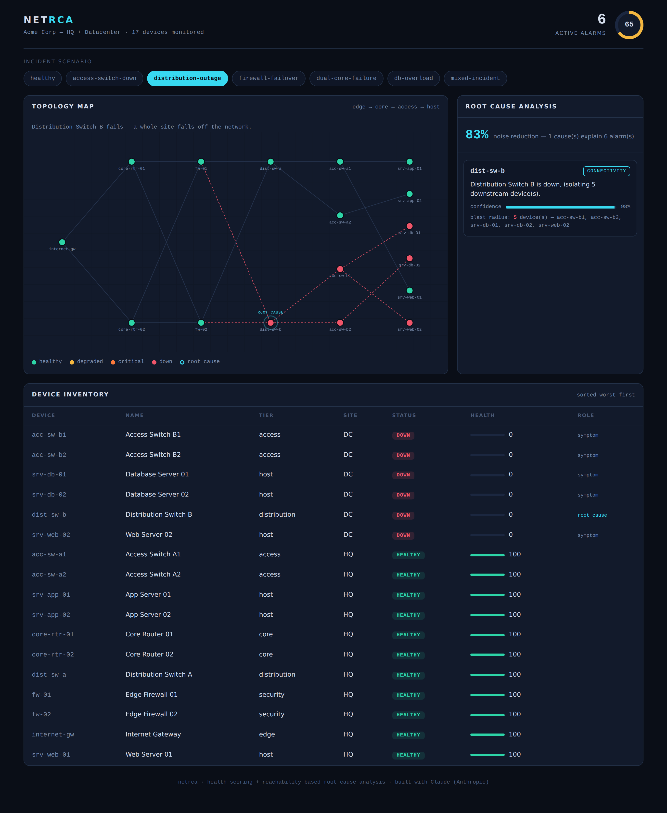

# NetRCA — Network Health & Root Cause Analysis

A small, dependency-light toolkit that monitors a network's health and, when
something breaks, tells you the **one device to fix** instead of drowning you in
a cascade of downstream alarms.

When a switch fails, every device behind it alarms too. An operator staring at
forty red alerts needs to know the single root cause. NetRCA models the network
as a dependency graph, scores each device's health from telemetry, and uses
**reachability analysis** to separate the genuine fault from its blast radius.



> **Note:** This project was built with the help of **Claude** (Anthropic) —
> design, implementation, and tests were produced in collaboration with Claude.

---

## What it does

- **Health scoring** — turns per-device telemetry (latency, packet loss, CPU,
  memory, interface errors, reachability) into an explainable 0–100 score and a
  status of `healthy` / `degraded` / `critical` / `down`.
- **Root cause analysis** — collapses an alarm storm into a minimal set of root
  causes, each with a confidence score, a plain-English reason, and its blast
  radius. Typical noise reduction is 70–90%.
- **Redundancy-aware** — a failed device whose traffic reroutes is reported as
  "down, no service impact" rather than a false incident.
- **NOC dashboard** — a Flask web UI with a live topology map, root-cause cards,
  and a worst-first device inventory.
- **Fault simulator** — reproducible scenarios (access-switch outage, whole-site
  distribution failure, dual-core meltdown, server overload, mixed incidents)
  for demos and tests.

## How the RCA works

Edges in the topology point downstream: a device depends on everything upstream
of it back to the gateway. The key insight:

> A device that is **down but would still be reachable** through the rest of the
> network is failing on its own — a *genuine fault*. A device that is down and is
> **cut off no matter what** is *collateral* — something upstream broke its path.

So the engine:

1. Takes the set of fully-down devices from the health report.
2. For each one, checks reachability from the gateway while pretending only the
   *other* down devices failed. If the gateway can still reach it, the fault is
   local to that device.
3. Attributes every collateral device to the most-upstream genuine fault on its
   dependency path — that fault is the root cause; the rest are its blast radius.
4. Surfaces reachable-but-overloaded devices as separate *performance* root
   causes.

Because attribution is reachability-based, redundancy is handled for free: a
failure that reroutes explains no collateral and is flagged as having no impact.

## Quick start

```bash
git clone <your-repo-url>
cd network-health-rca

python -m venv .venv && source .venv/bin/activate
pip install -r requirements.txt

# list the built-in fault scenarios
python run.py scenarios

# run health + RCA for a scenario and print a report
python run.py analyze distribution-outage

# launch the dashboard at http://127.0.0.1:5000
python run.py serve
```

### Example output

```
$ python run.py analyze distribution-outage

Scenario : distribution-outage
Health   : 65/100   (6 device(s) alarming)
...
Root cause analysis
------------------------------------------------------------
1 root cause(s) explain 6 alarm(s) (83% noise reduction):
  • dist-sw-b  [connectivity, 98%]  Distribution Switch B is down, isolating 5 downstream device(s)

Suppressed as downstream symptoms:
  acc-sw-b1, acc-sw-b2, srv-db-01, srv-db-02, srv-web-02
```

## Using it on your own network

The topology lives in [`data/topology.json`](data/topology.json): a list of
devices (`id`, `name`, `type`, `tier`, `site`) and directed `links` (`from`
upstream → `to` downstream), plus the `gateway` every device must reach. Point
the CLI at your own file:

```bash
python run.py --topology my-network.json analyze
```

Telemetry here is generated by the simulator. To wire in real data, feed
`netrca.telemetry.DeviceMetrics` from your monitoring source (SNMP, streaming
telemetry, an observability API) and pass the snapshot to `HealthEngine` and
`RCAEngine` directly:

```python
from netrca import Topology, HealthEngine, RCAEngine

topo = Topology.load("my-network.json")
report = HealthEngine().evaluate(topo, my_live_telemetry)
result = RCAEngine().analyze(topo, report)
print(result.summary())
```

## Project layout

```
network-health-rca/
├── run.py                  # CLI: scenarios · analyze · serve
├── netrca/
│   ├── topology.py         # dependency graph + reachability / impact maths
│   ├── telemetry.py        # metric model + synthetic baseline generator
│   ├── health.py           # threshold-based health scoring & alerts
│   ├── rca.py              # reachability-based root cause engine
│   ├── simulator.py        # reproducible fault scenarios
│   └── web/                # Flask dashboard (app + template + CSS)
├── data/topology.json      # sample HQ + datacenter topology
├── tests/                  # unittest suite (topology, health, rca)
└── docs/                   # dashboard screenshots
```

## Tests

```bash
python -m unittest discover -s tests -v
```

The suite (23 tests) covers reachability and redundancy maths, health scoring
and status classification, and root cause identification across every scenario —
including a check that no scenario ever leaves an alarm unexplained.

## Built with

Python 3.11+, [Flask](https://flask.palletsprojects.com/),
[NetworkX](https://networkx.org/), and NumPy. No external services or network
access required to run.

## License

MIT — see [LICENSE](LICENSE).

---

*Built with [Claude](https://claude.ai) by Anthropic.*
